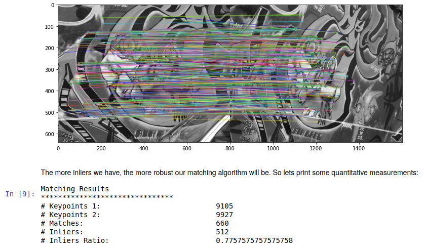

# beblid-opencv-demo
## How to improve a 14% your image matching with only one line of code? BEBLID is the key!  

[BEBLID](https://docs.opencv.org/4.5.1/d7/d99/classcv_1_1xfeatures2d_1_1BEBLID.html) is 
an efficient binary descriptor learned with boosting. It is able to describe keypoints 
from any detector just by changing the scale_factor parameter. In several benchmarks it 
has proved to largely improve other binary descriptors like ORB or BRISK with the same 
efficiency. BEBLID describes using the difference of mean gray values in different 
regions of the image around the KeyPoint, the descriptor is specifically optimized for 
image matching and patch retrieval addressing the asymmetries of these problems.

This repo contains in [`demo.ipynb`](demo.ipynb) a python notebook example that shows you how well it works compared with ORB,
since both have the same interface, this improvement takes only 1 line of code!
 
## Install 

If you want to run the python notebook in your Ubuntu 18.04, follow these instructions:

``` 
sudo apt-get install python3 python3-pip python3-venv
python3 -m venv venv
source venv/bin/activate
python3 -m pip install --upgrade pip
pip3 install notebook matplotlib
```

## Running
Now to run the notebook:
```
jupyter notebook Demo.ipynb
```

If all the cells are correctly executed you should see a result like this:



## References

If you find this repository useful please cite [our paper](https://raw.githubusercontent.com/iago-suarez/BEBLID/master/BEBLID_Boosted_Efficient_Binary_Local_Image_Descriptor.pdf):

```bibtex
@article{SUAREZ2020,
title = "BEBLID: Boosted Efficient Binary Local Image Descriptor",
journal = "Pattern Recognition Letters",
year = "2020",
issn = "0167-8655",
doi = "https://doi.org/10.1016/j.patrec.2020.04.005",
url = "http://www.sciencedirect.com/science/article/pii/S0167865520301252",
author = "Iago Suárez and Ghesn Sfeir and José M. Buenaposada and Luis Baumela",
keywords = "Local image descriptors, Binary descriptors, Real-time, Efficient matching, Boosting",
abstract = "Efficient matching of local image features is a fundamental task in many computer vision applications. However, the real-time performance of top matching algorithms is compromised in computationally limited devices, such as mobile phones or drones, due to the simplicity of their hardware and their finite energy supply. In this paper we introduce BEBLID, an efficient learned binary image descriptor. It improves our previous real-valued descriptor, BELID, making it both more efficient for matching and more accurate. To this end we use AdaBoost with an improved weak-learner training scheme that produces better local descriptions. Further, we binarize our descriptor by forcing all weak-learners to have the same weight in the strong learner combination and train it in an unbalanced data set to address the asymmetries arising in matching and retrieval tasks. In our experiments BEBLID achieves an accuracy close to SIFT and better computational efficiency than ORB, the fastest algorithm in the literature."
}
```

More details in [the original repo](https://github.com/iago-suarez/BEBLID).